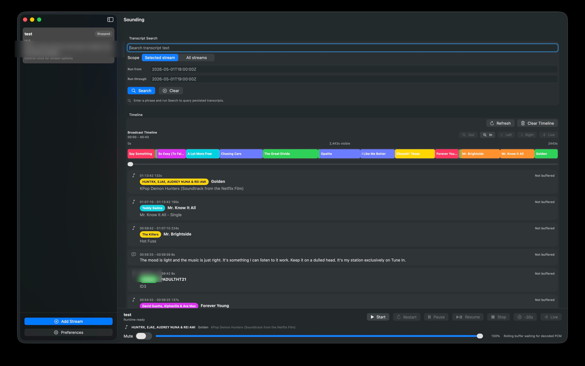

# Sounding

Sounding is a macOS app for monitoring live audio streams. It turns an HLS or Icecast/ICY URL into a searchable timeline of songs, ads, broadcast markers, transcripts, and buffered audio.



## Download

Download the latest signed build from [GitHub Releases](https://github.com/keithah/sounding/releases/latest). Open `Sounding.dmg`, drag Sounding to Applications, and launch it.

Sounding is early but usable. Public builds are signed, notarized, and wired for Sparkle updates.

## What You Can Do

- Add a live stream URL and let Sounding detect the stream type.
- Watch the broadcast timeline fill with song metadata, ad/program markers, and speech rows.
- Scan long sessions with a horizontal timeline of colored program spans.
- Search transcript text across the selected stream or every stream.
- Click buffered timeline rows to replay recent audio.
- Copy or save transcript rows with timestamps.
- Choose whether transcripts show always, only for non-song content, or not at all.

## Why It Exists

Live streams are hard to inspect after the moment passes. Sounding keeps a local operating view of what happened: what played, what was said, where ads or markers appeared, and what audio is still replayable.

It is useful for stream QA, radio and music programming checks, ad-marker inspection, live metadata validation, and post-run review.

## Timeline and Metadata

Sounding combines several signals into one timeline:

- Timed ID3 metadata from HLS streams.
- SCTE-35 and manifest markers when present.
- Audio fingerprinting and AcoustID enrichment for song recognition.
- Local transcription for speech and non-song content.
- Optional rolling audio cache for replay.

Metadata is normalized at ingest so repeated song hits are shown as coherent spans instead of noisy duplicate rows.

## Privacy

Sounding is local-first. Stream URLs, databases, runtime evidence, and release proof outputs should stay on your machine. Do not paste signed stream URLs or local database paths into issues, pull requests, or tracked docs.

The release build includes a bundled AcoustID application key for convenience. You can override it in Preferences if needed.

## Build From Source

Requirements: macOS, Xcode, and Swift 5.9.

```sh
swift build --product sounding
swift test
DEVELOPER_DIR=/Applications/Xcode.app/Contents/Developer \
  xcodebuild -project Sounding.xcodeproj -scheme Sounding -configuration Debug build
```

If `swift test` only builds in your local environment, run the XCTest bundle directly:

```sh
DEVELOPER_DIR=/Applications/Xcode.app/Contents/Developer \
  xcrun xctest .build/debug/SoundingPackageTests.xctest
```

## Repository Layout

- `App/`: macOS SwiftUI app.
- `Sources/SoundingKit/`: stream runtime, ingest, playback, metadata, persistence, timeline, search, and export logic.
- `Sources/sounding/`: command-line tools for ingest, monitoring, search, export, diagnostics, and verification.
- `Tests/SoundingKitTests/`: XCTest coverage and fixtures.
- `Docs/`: shipping, verification, and operational notes.
- `scripts/distribution/`: signing, notarization, DMG, and Sparkle appcast helpers.

## Release Process

Public builds are distributed through GitHub Releases as signed and notarized DMGs. Sparkle update metadata is published as `appcast.xml` with each release. The detailed release runbook is in [Docs/shipping.md](Docs/shipping.md).

Generated DMGs, appcasts, signing logs, live evidence, local databases, and stream configs belong in ignored local workspaces.
